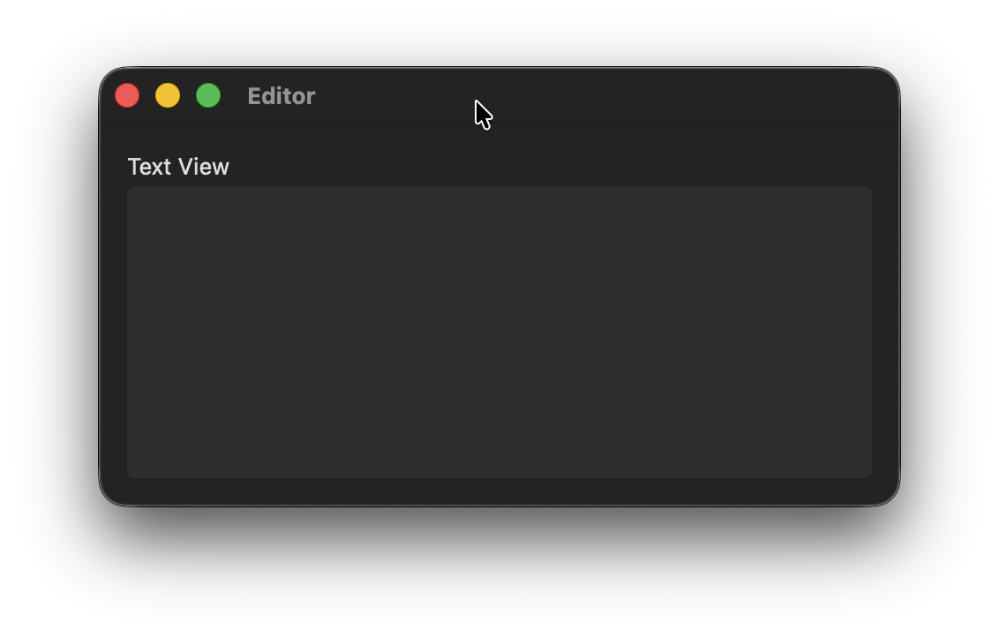
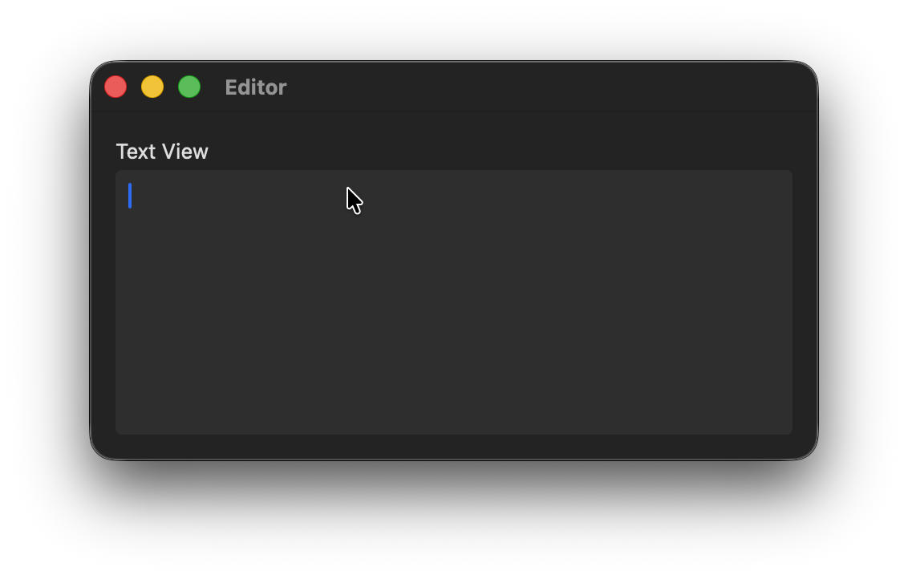

# FocusableTextView

Keyboard-focusable TextView for **macOS SwiftUI**.

FocusableTextView is a custom SwiftUI TextView for macOS with full keyboard focus management. It supports Tab / Shift+Tab key-loop navigation, correctly receives focus on click, and removes focus when clicking outside the control.

<p float="left">
  
  
</p>

## Installation (Swift Package Manager)

Add package in Xcode:

File → Add Packages Dependencies… → https://github.com/Eugene-Kugut/FocusableTextView.git

## Usage

```swift
import SwiftUI
import FocusableTextView

struct DemoView: View {

    @State private var description: String = ""
    var body: some View {
        FocusableTextView(
            text: $description
        )
    }
}
```

## Customization

```swift
FocusableTextView(
    text: $text,
    font: .systemFont(ofSize: NSFont.systemFontSize),
    backgroundColor: Color(NSColor.systemFill).opacity(0.5),
    disabled: false,
    cornerRadius: 4,
    contentInsets: .init(top: 8, left: 4, bottom: 8, right: 4)
)
```
